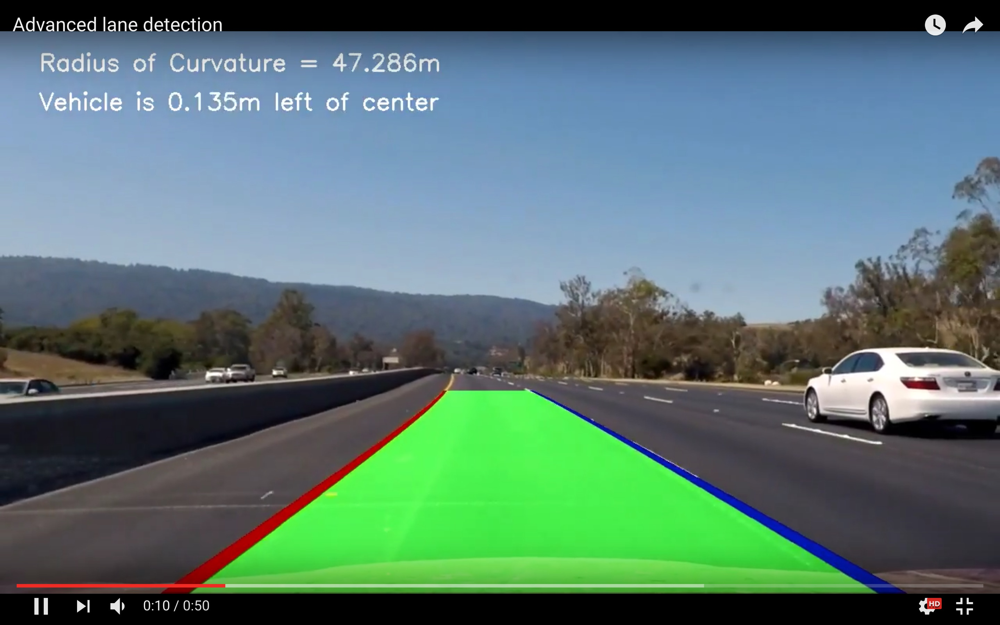

##**Advanced Lane Finding Project**

[](https://www.youtube.com/watch?v=8ZJUr4i9dOM&feature=youtu.be)


These are the steps used to detect lane lines in the  project:

* Compute the camera calibration matrix and distortion coefficients given a set of chessboard images.
* Apply a distortion correction to raw images.
* Use color transforms, gradients, etc., to create a thresholded binary image.
* Apply a perspective transform to rectify binary image ("birds-eye view").
* Detect lane pixels and fit to find the lane boundary.
* Determine the curvature of the lane and vehicle position with respect to center.
* Warp the detected lane boundaries back onto the original image.
* Output visual display of the lane boundaries and numerical estimation of lane curvature and vehicle position.

[//]: # (Image References)

[image1]: ./examples/distor.jpg "Undistorted"
[image2]: ./test_images/test1.jpg "Road Transformed"
[image3]: ./examples/threshold.jpg "Binary Example"
[image4]: ./examples/warped.jpg "Warp Example"
[image5]: ./examples/conv1d.jpg "Fit Visual"
[image6]: ./examples/output_img.jpg "Output"
[video1]: ./project_video.mp4 "Video"
[image7]: ./examples/distort.jpg "distorted"
[image8]: ./examples/undist0.jpg "Undistorted"
[image9]: ./examples/threshold.jpg "Threshold"
[image10]: ./examples/poly_fit.jpg "Poly Fit"

---

####1. Camera Calibration

The code for this step is located in "cam_calibrate.py" 

I start by preparing "object points", which will be the (x, y, z) coordinates of the chessboard corners in the world. Here I am assuming the chessboard is fixed on the (x, y) plane at z=0, such that the object points are the same for each calibration image.  Thus, `objp` is just a replicated array of coordinates, and `objpoints` will be appended with a copy of it every time I successfully detect all chessboard corners in a test image.  `imgpoints` will be appended with the (x, y) pixel position of each of the corners in the image plane with each successful chessboard detection.  

I then used the output `objpoints` and `imgpoints` to compute the camera calibration and distortion coefficients using the `cv2.calibrateCamera()` function.  I applied this distortion correction to the test image using the `cv2.undistort()` function and obtained this result: 

Undistorted and Distorted image
![alt text][image1]

###Pipeline (single images)

####1. Distortion-corrected image from the training set
To demonstrate this step, I will describe how I apply the distortion correction to one of the test images like this one:

Distorted test image
![alt text][image7]

Undistorted test image
![alt text][image8]


####2. Color transforms and Gradients - Combination of Color transforms- Saturation (sthresh=(100, 255) and Value (vthresh=(50,255)) were used with Gradient transformation sobel in x (thresh =(12, 255)) and y =(thresh =(25, 255)) direction to create a thresholded binary image.  (thresholding steps at lines 112 through 116 in `lane_finder.py`).  Here's an example of my output for this step.

![alt text][image3]

####3. Perspective transform -

I have used the cv2 warp perspective function along with the perspective transform to make the transformation. The cv2 warp perspective function takes as inputs an image (`img`), as well as source (`src`) and destination (`dst`) points.  I chose to hardcode the source and destination points in the following manner:

```
src = np.float32(
    [[(img_size[0] / 2) - 55, img_size[1] / 2 + 100],
    [((img_size[0] / 6) - 10), img_size[1]],
    [(img_size[0] * 5 / 6) + 60, img_size[1]],
    [(img_size[0] / 2 + 55), img_size[1] / 2 + 100]])
dst = np.float32(
    [[(img_size[0] / 4), 0],
    [(img_size[0] / 4), img_size[1]],
    [(img_size[0] * 3 / 4), img_size[1]],
    [(img_size[0] * 3 / 4), 0]])

```
This resulted in the following source and destination points:

| Source        | Destination   | 
|:-------------:|:-------------:| 
| 585, 460      | 320, 0        | 
| 203, 720      | 320, 720      |
| 1127, 720     | 960, 720      |
| 695, 460      | 960, 0        |

The perspective transform was working as expected by drawing the `src` and `dst` points onto a test image and its warped counterpart to verify that the lines appear parallel in the warped image.

![alt text][image4]

####4. Finding Lane pixels and fitting a polyline

Then I used convolutional in 1d to maximize the hot pixels in each window. In this case, it was a summation of window template and vertical slice of the pixel image. The window template is slided across the image from left to right and any overlapping values are summed together, creating the convolved signal. The peak of the convolved signal is where there is the highest overlap of pixels and the most likely position for the lane marker. You can check for the code in `lane_finder.py` between line 153 to 177. I am calculating most stuff in the `tracker.py`. For fitting the polynomial I used the numpy poly fit, fitting the centroid of the windows.

![alt text][image5]

####5. Radius of curvature and the position of vehicle

Radius of curvature is calculate in lines 225 in my code in `lane_finder.py`. It uses the fourmulae given on page [Radius of curvature](http://www.intmath.com/applications-differentiation/8-radius-curvature.php). The position of vehicle is calculate from the centre in the line 228 to 233 by calculating the postion of centre and its difference from center of the warped image.

![alt text][image10]

####6. Example of final result

The final video is processed in a different pipeline in file called `video_processor.py` in the function `process_image()`.  Here is an example of my result on a test image:

![alt text][image6]

---

###Pipeline (video)

Here's a [link to my video result](https://youtu.be/8ZJUr4i9dOM)

---

###Discussion

The pipeline seems to be doing well for this video but it might fail if light conditions change a lot or if the road becomes lot more curvy instead of having straight path.

